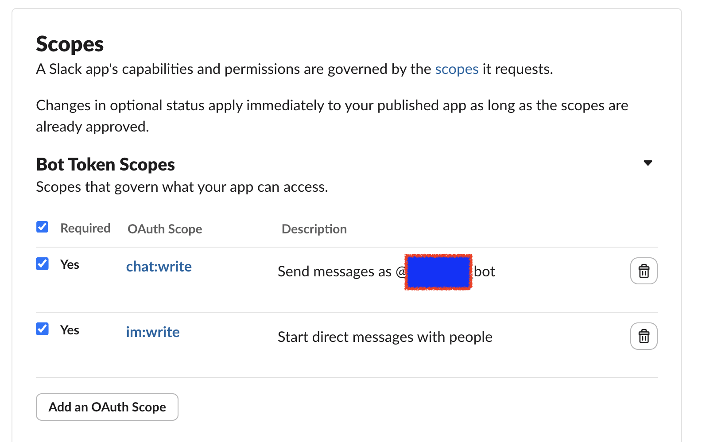
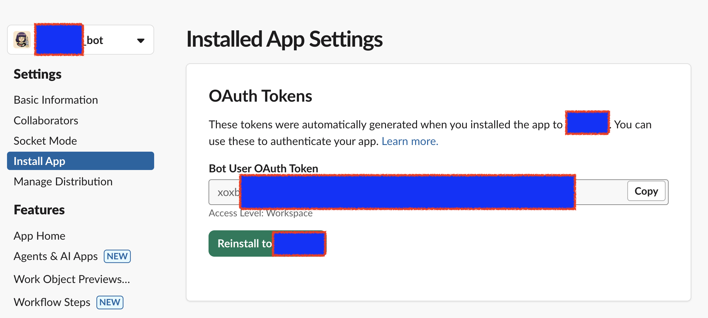

```bash +exec_replace
figlet -f standard "PR Slack" && figlet -f standard "Notifier"
```

GitHub PR 알림을 Slack으로 전달하는 CLI 도구

- Rust로 작성
- GitHub Enterprise API에서 열린 PR 조회
- 담당자/리뷰어에게 Slack 알림 발송
- Bot Token으로 담당자에게 개인 DM 전송

<!-- end_slide -->

## 왜 만들었나?

사내 GitHub Enterprise는 외부 서비스 직접 연동이 불가

- GitHub for Slack 앱 설치 불가 (네트워크 제한)
- GitHub Actions에서 외부 Slack 호출 불가
- GHE Webhook을 외부로 보낼 수 없는 구조

**해결**: 내부 네트워크에서 GHE API를 polling하고, Slack API로 발송하는 중계 도구를 직접 만들었다

```text
[사내 네트워크]           [실행 환경]            [외부]
  GHE API    ←────→   pr-slack-notifier   ────→   Slack API
```

<!-- end_slide -->

## config.json 설정

| 필드 | 설명 |
|------|------|
| `GITHUB_API_URL` | GitHub Enterprise API base URL |
| `GITHUB_ORG` | GitHub 조직명 |
| `GITHUB_TOKEN` | GitHub Personal Access Token |
| `SLACK_BOT_TOKEN` | Slack Bot Token |
| `REMINDER_HOURS` | 리마인더 기준 시간 (미설정 시 전체) |
| `USER_MAPPING` | GitHub username → Slack user ID 매핑 |

```json
{
    "GITHUB_API_URL": "https://your-domain/api/v3",
    "GITHUB_ORG": "your-org",
    "GITHUB_TOKEN": "ghp_xxx...",
    "SLACK_BOT_TOKEN": "xoxb-xxx...",
    "REMINDER_HOURS": 48,
    "USER_MAPPING": {
        "github-username": "U01ABCDEF"
    }
}
```

<!-- end_slide -->

## Slack Bot 권한 설정

**OAuth & Permissions** → **Bot Token Scopes**에 다음 권한 추가:

- `chat:write` - 메시지 전송
- `im:write` - DM 전송



<!-- end_slide -->

## Slack Bot 앱 설치

권한 추가 후 **Install App to Workspace**로 앱을 워크스페이스에 설치 (또는 재설치)

- scope 변경 시 반드시 **Reinstall App**해야 토큰에 반영됨 (재설치 안 하면 `missing_scope` 에러 발생)
- 설치 후 발급되는 `xoxb-...` 토큰을 `SLACK_BOT_TOKEN`에 설정


